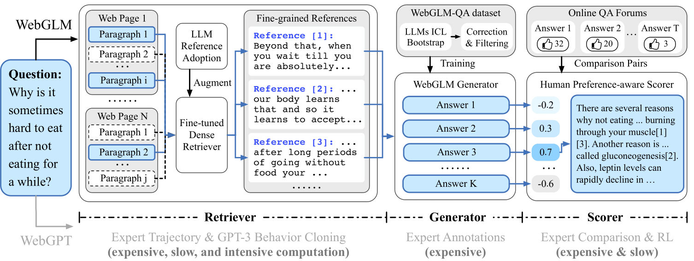

<h1>WebGLM: Towards An Efficient Web-enhanced Question Answering System with Human Preference</h1>

<p align="center">📃 <a href="https://arxiv.org/pdf/2306.07906.pdf" target="_blank">Paper (KDD 2023)</a>

This is official implementation of WebGLM. And the table of contents is shown below.


https://github.com/THUDM/WebGLM/assets/129033897/d2e1dd35-6340-4175-ac2d-fd585daa17cf


<!-- TOC -->

-   [Overview](#overview)
    -   [Features](#features)
-   [Preparation](#preparation)
    -   [Prepare Code and Environments](#prepare-code-and-environments)
    -   [Prepare SerpAPI Key](#prepare-serpapi-key)
    -   [Prepare Retriever Checkpoint](#prepare-retriever-checkpoint)
-   [Try WebGLM](#try-webglm)
    -   [Export Environment Variables](#export-environment-variables)
    -   [Run as Command Line Interface](#run-as-command-line-interface)
    -   [Run as Web Service](#run-as-web-service)
-   [Train WebGLM](#train-webglm)
    -   [Train Generator](#train-generator)
        -   [Prepare Data](#prepare-data)
        -   [Training](#training)
    -   [Train Retriever](#train-retriever)
        -   [Prepare Data](#prepare-data-1)
        -   [Training](#training-1)
-   [Evaluation](#evaluation)
-   [Real Application Cases](#real-application-cases)
-   [Citation](#citation)

# Overview



WebGLM aspires to provide an efficient and cost-effective web-enhanced question-answering system using the 10-billion-parameter General Language Model (GLM). It aims to improve real-world application deployment by integrating web search and retrieval capabilities into the pre-trained language model.

## Features

-   **LLM-augmented Retriever**: Enhances the retrieval of relevant web content to better aid in answering questions accurately.
-   **Bootstrapped Generator**: Generates human-like responses to questions, leveraging the power of the GLM to provide refined answers.
-   **Human Preference-aware Scorer**: Estimates the quality of generated responses by prioritizing human preferences, ensuring the system produces useful and engaging content.

# Preparation

## Prepare Code and Environments

Clone this repo, and install python requirements.

```bash
pip install -r requirements.txt
```

Install Nodejs.

```bash
apt install nodejs # If you use Ubuntu
```

Install playwright dependencies.

```bash
playwright install
```

If browsing environments are not installed in your host, you need to install them. Do not worry, playwright will give you instructions when you first execute it if so.

## Prepare SerpAPI Key

In search process, we use SerpAPI to get search results. You need to get a SerpAPI key from [here](https://serpapi.com/).

Then, set the environment variable `SERPAPI_KEY` to your key.

```bash
export SERPAPI_KEY="YOUR KEY"
```

## Prepare Retriever Checkpoint

Download the checkpoint on [Tsinghua Cloud](https://cloud.tsinghua.edu.cn/d/54056861b2f34bbfb3f9/) by running the command line below.

You can manually specify the path to save the checkpoint by `--save SAVE_PATH`.

```bash
python download.py retriever-pretrained-checkpoint
```

# Try WebGLM

Before you run the code, make sure that the space of your device is enough.

## Export Environment Variables

Export the environment variable `WEBGLM_RETRIEVER_CKPT` to the path of the retriever checkpoint. If you have downloaded the retriever checkpoint in the default path, you can simply run the command line below.

```bash
export WEBGLM_RETRIEVER_CKPT=./download/retriever-pretrained-checkpoint
```

## Run as Command Line Interface

```bash
python cli_demo.py
```

## Run as Web Service

```bash
python web_demo.py
```

# Train WebGLM

## Train Generator

### Prepare Data

Download the training data on [Tsinghua Cloud](https://cloud.tsinghua.edu.cn/d/ae204894f2e842f19a3f/) by running the command line below.

```bash
python download.py generator-training-data
```

It will automatically download all the data and preprocess them into the seq2seq form that can be used immediately in `./download`.

### Training

Please refer to [GLM repo](https://github.com/THUDM/GLM#train-with-your-own-data) for seq2seq training.

## Train Retriever

### Prepare Data

Download the training data on [Tsinghua Cloud](https://cloud.tsinghua.edu.cn/d/fa5e6eb1afac4f08a4c6/) by running the command line below.

```bash
python download.py retriever-training-data
```

### Training

Run the following command line to train the retriever. If you have downloaded the retriever training data in the default path, you can simply run the command line below.

```bash
python train_retriever.py --train_data_dir ./download/retriever-training-data
```

# Evaluation

You can reproduce our results on TriviaQA, WebQuestions and NQ Open. Take TriviaQA for example, you can simply run the command line below:

```bash
bash scripts/triviaqa.sh
```

and start running the experiment.

# Real Application Cases

[Here](assets/cases) you can see some examples of WebGLM real application scenarios.

# Citation

If you use this code for your research, please cite our paper.

```
@misc{liu2023webglm,
      title={WebGLM: Towards An Efficient Web-Enhanced Question Answering System with Human Preferences},
      author={Xiao Liu and Hanyu Lai and Hao Yu and Yifan Xu and Aohan Zeng and Zhengxiao Du and Peng Zhang and Yuxiao Dong and Jie Tang},
      year={2023},
      eprint={2306.07906},
      archivePrefix={arXiv},
      primaryClass={cs.CL}
}
```

> This repo is simplified for easier deployment.
